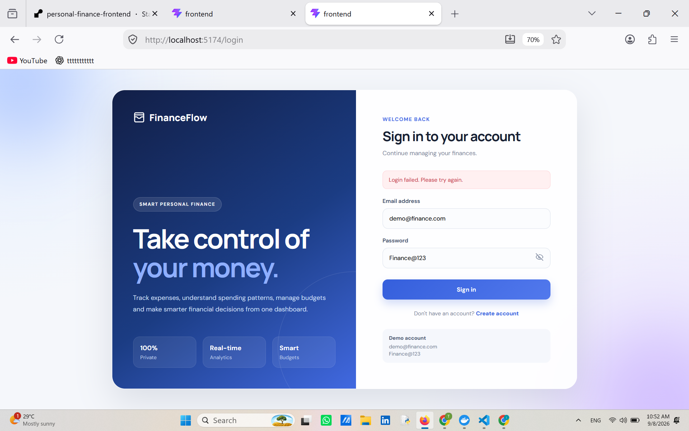
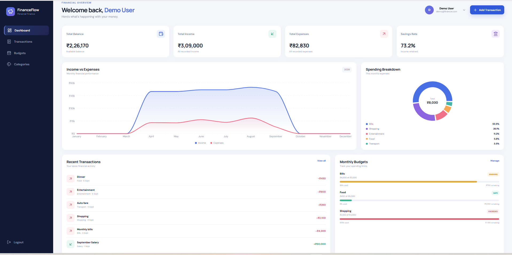
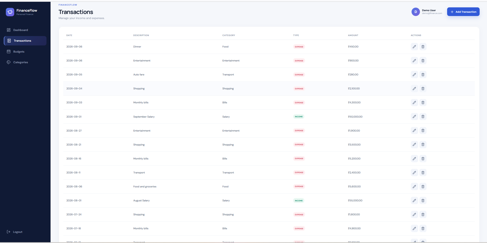
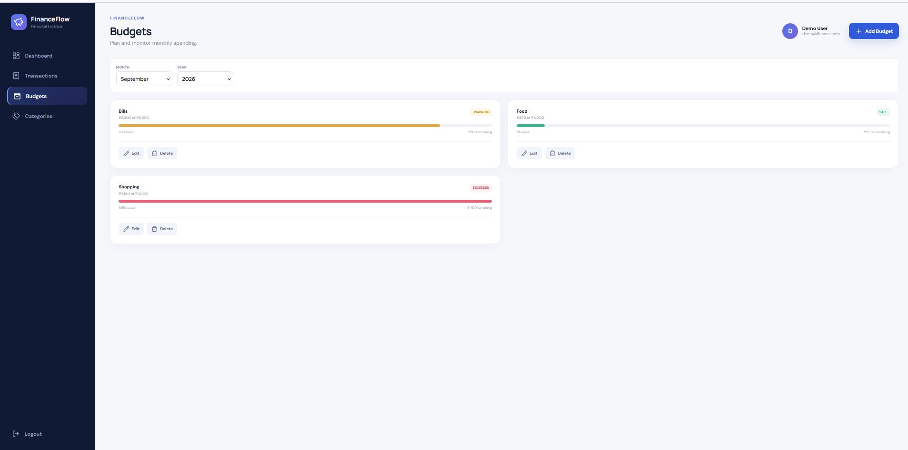
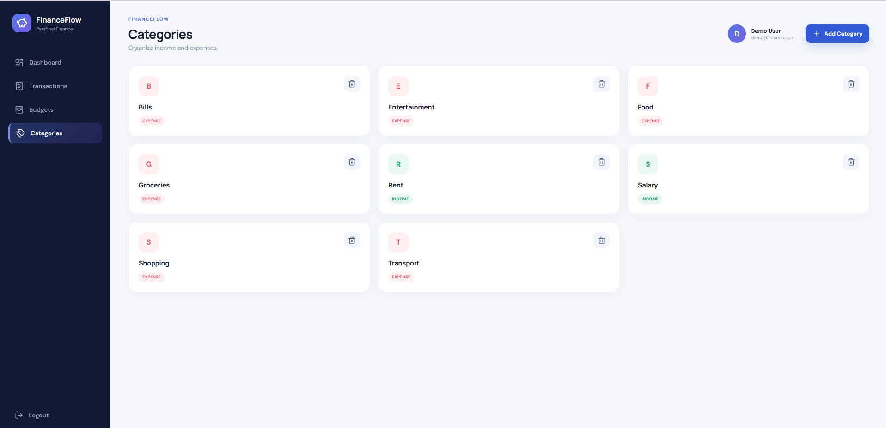
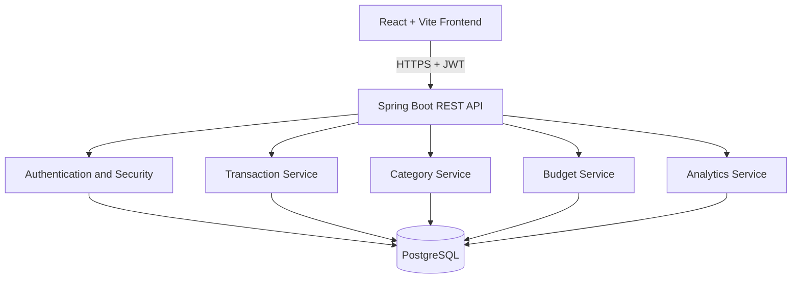

# FinanceFlow

FinanceFlow is a full-stack personal finance and expense analytics platform built for individuals who want to track income, expenses, categories, and monthly budgets in one place. It provides secure user authentication, transaction management, budget monitoring, and interactive financial analytics through a React frontend backed by a Spring Boot REST API and PostgreSQL.

## Live deployment

- Web application: [https://personal-finance-frontend-2e2h.onrender.com](https://personal-finance-frontend-2e2h.onrender.com)
- Backend API: [https://personal-finance-backend-ldr4.onrender.com](https://personal-finance-backend-ldr4.onrender.com)
- Source code: [https://github.com/Tejashribambal19/personal-finance](https://github.com/Tejashribambal19/personal-finance)

> The Render free backend instance can take some time to wake after inactivity. Most backend endpoints require JWT authentication, so the backend URL may return an authorization response instead of a webpage.

## Key features

- Secure user registration and login
- JWT-based stateless authentication
- BCrypt password hashing
- User-specific financial data isolation
- Income and expense transaction tracking
- Create, view, edit, and delete transactions
- Custom income and expense categories
- Monthly category-based budget management
- Total income, total expenses, and balance calculations
- Savings-rate calculation
- Monthly income-versus-expense trend visualization
- Category-wise expense breakdown with percentages
- Month-over-month expense comparison
- Recent transaction overview
- Budget utilization with safe, warning, and exceeded states
- Protected React routes and authenticated API requests
- PostgreSQL persistence using Spring Data JPA and Hibernate
- Docker-based local PostgreSQL and pgAdmin setup
- Render frontend/backend deployment with Neon PostgreSQL

## Screenshots

### Login



### Dashboard



### Transactions



### Budgets



### Categories



## Architecture



## Technology stack

| Layer | Technologies |
|---|---|
| Frontend | React 19, Vite 8, React Router, Axios |
| UI / Charts | CSS, Lucide React, Recharts |
| Backend | Java 17, Spring Boot 4.1.1, Spring Web MVC, Spring Data JPA |
| Security | Spring Security, JWT, BCrypt |
| Data | PostgreSQL 17, Hibernate |
| Build | Maven Wrapper, npm |
| Infrastructure | Docker Compose, PostgreSQL, pgAdmin |
| Deployment | Render Static Site, Render Web Service, Neon PostgreSQL |

## Demo account

| Account | Email | Password |
|---|---|---|
| Demo User | `demo@finance.com` | `Finance@123` |

The demo account is pre-populated with sample categories, transactions, budgets, and analytics data so the complete application can be explored immediately.

## Prerequisites

- Java Development Kit 17
- Node.js and npm
- Docker Desktop with Docker Compose
- Git

## Run the project locally

### 1. Clone the repository

```powershell
git clone https://github.com/Tejashribambal19/personal-finance.git
cd personal-finance
```

### 2. Start PostgreSQL and pgAdmin

```powershell
docker compose up -d
docker compose ps
```

Local PostgreSQL:

```text
Host: localhost
Port: 5433
Database: personal_finance_db
Username: finance_user
Password: finance_password
```

pgAdmin:

```text
URL: http://localhost:5050
Email: admin@finance.com
Password: admin
```

When adding the Docker PostgreSQL server inside pgAdmin, use:

```text
Host: postgres
Port: 5432
Database: personal_finance_db
Username: finance_user
Password: finance_password
```

### 3. Start the backend

Open a new PowerShell terminal:

```powershell
cd backend
.\mvnw.cmd spring-boot:run
```

The backend runs at:

```text
http://localhost:8081
```

### 4. Configure and start the frontend

Open another PowerShell terminal:

```powershell
cd frontend
Copy-Item .env.example .env
npm install
npm run dev
```

The frontend runs at:

```text
http://localhost:5173
```

## Configuration

The backend reads database, JWT, CORS, and server settings from environment variables.

| Variable | Purpose | Local default |
|---|---|---|
| `PGHOST` | PostgreSQL host | `localhost` |
| `PGPORT` | PostgreSQL port | `5433` |
| `PGDATABASE` | PostgreSQL database | `personal_finance_db` |
| `PGUSER` | PostgreSQL username | `finance_user` |
| `PGPASSWORD` | PostgreSQL password | `finance_password` |
| `JWT_SECRET` | JWT signing secret | Development fallback |
| `JWT_EXPIRATION` | Token lifetime | `86400000` |
| `CORS_ALLOWED_ORIGINS` | Allowed frontend origins | `http://localhost:5173,http://127.0.0.1:5173` |
| `SHOW_SQL` | Hibernate SQL logging | `false` |
| `PORT` | Backend HTTP port | `8081` |

The frontend uses:

| Variable | Purpose | Local default |
|---|---|---|
| `VITE_API_URL` | Backend API base URL | `http://localhost:8081/api` |

Production backend variables on Render include:

```text
SPRING_DATASOURCE_URL
SPRING_DATASOURCE_USERNAME
SPRING_DATASOURCE_PASSWORD
JWT_SECRET
CORS_ALLOWED_ORIGINS
```

Never commit real passwords, private database URLs, `.env` files, or JWT secrets.

## Main API endpoints

| Method | Endpoint | Purpose |
|---|---|---|
| `POST` | `/api/auth/register` | Register a new user |
| `POST` | `/api/auth/login` | Authenticate a user |
| `GET/POST` | `/api/categories` | List or create categories |
| `DELETE` | `/api/categories/{categoryId}` | Delete a category |
| `GET/POST` | `/api/transactions` | List or create transactions |
| `GET/PUT/DELETE` | `/api/transactions/{transactionId}` | Read, update, or delete a transaction |
| `GET/POST` | `/api/budgets` | List or create budgets |
| `PUT/DELETE` | `/api/budgets/{budgetId}` | Update or delete a budget |
| `GET` | `/api/analytics/summary` | Income, expense, and balance summary |
| `GET` | `/api/analytics/category-breakdown` | Category-wise monthly expense breakdown |
| `GET` | `/api/analytics/monthly-trend` | Monthly income and expense trend |
| `GET` | `/api/analytics/monthly-comparison` | Compare current and previous month expenses |

All endpoints except registration and login require:

```http
Authorization: Bearer <JWT>
```

## Testing

Run backend tests:

```powershell
cd backend
.\mvnw.cmd clean test
```

Build the backend:

```powershell
.\mvnw.cmd clean package
```

Build the frontend:

```powershell
cd frontend
npm install
npm run build
```

## Demo flow

1. Open the live FinanceFlow application.
2. Sign in using the demo account.
3. Show total balance, income, expenses, and savings rate.
4. Show the income-versus-expense monthly chart.
5. Show the category-wise spending breakdown.
6. Open Transactions and review the existing transaction history.
7. Add a new income or expense transaction.
8. Edit or delete a transaction and show the dashboard update.
9. Open Categories and demonstrate category management.
10. Open Budgets and show monthly budget utilization.
11. Create or update a budget and demonstrate safe, warning, or exceeded states.
12. Refresh the application and confirm that all data remains stored in PostgreSQL.

## Project structure

```text
personal-finance/
├── backend/              Spring Boot REST API
├── frontend/             React + Vite frontend
├── docs/
│   └── screenshots/      Project screenshots
├── docker-compose.yml    Local PostgreSQL and pgAdmin
├── .gitignore
└── README.md
```

## Production considerations

- Replace development JWT fallback values with a strong production secret.
- Keep database passwords and JWT secrets only in managed environment variables.
- Rotate any credential immediately if it is exposed.
- Use Flyway or Liquibase instead of automatic Hibernate schema updates for long-term production use.
- Add refresh-token or session-revocation support.
- Add email verification and password-reset workflows.
- Add authentication and API rate limiting.
- Add integration, end-to-end, security, and load tests.
- Add centralized monitoring, structured logging, and alerting.
- Configure PostgreSQL backups and recovery procedures.
- Add pagination, filtering, and search for larger transaction histories.

## Author

**Tejashri Bambal**

- GitHub: [https://github.com/Tejashribambal19](https://github.com/Tejashribambal19)

## License

This project was created as a full-stack portfolio project. Add a license before reuse or distribution.
